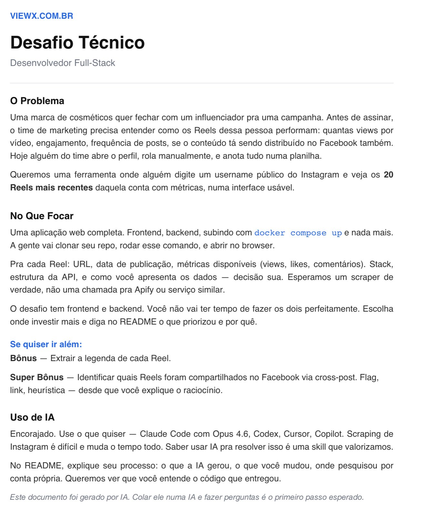

De cara já identifiquei que o teste tinha uma semelhança muito grande com um projeto que eu já tinha desenvolvido anteriormente, o [NoBSDownloader](https://github.com/self1027/NoBSDownloader). A partir disso, optei por não reinventar tudo do zero e usei essa base como referência. Comecei pedindo para a IA mapear os requisitos em um arquivo de documentação para ter clareza do escopo e, com isso em mãos, iniciei a implementação. A escolha pelo `Node.js` foi natural, principalmente pela possibilidade de reaproveitar partes da lógica já validada no projeto anterior. Para download de mídia, mantive o uso do `yt-dlp` porque já conheço bem o comportamento e sei que é uma ferramenta confiável na maioria dos cenários.

O primeiro passo foi entender como o Instagram organiza os reels. Identifiquei rapidamente o padrão de URL no formato `https://www.instagram.com/{user}/reels/` e comecei a desenvolver um scraper em cima disso. No entanto, logo nos primeiros testes ficou claro que o `yt-dlp` não estava mais funcionando corretamente para esse caso. Ele retornava erros como `unsupported URL` e falhas na extração de dados de usuário. Mesmo após tentar atualização para versões nightly, uso de cookies e execução direta via CLI, o comportamento continuava inconsistente. O próprio `yt-dlp` já indicava que o extractor para o Instagram estava marcado como quebrado, o que confirmou que o problema não era apenas na implementação. Inclusive, essa limitação já era discutida na issue [https://github.com/yt-dlp/yt-dlp/issues/11151](https://github.com/yt-dlp/yt-dlp/issues/11151).

A partir disso, tentei contornar a limitação explorando diretamente a estrutura da página. Percebi que o Instagram havia migrado fortemente para `GraphQL`, então implementei uma integração direta com esse endpoint utilizando uma query persistente identificada por um `doc_id` específico. Com isso, consegui acessar os dados brutos da mídia sem depender da renderização HTML. Para viabilizar essa comunicação, precisei tratar manualmente os cookies exportados no formato Netscape, criando um parser que limpava caracteres inválidos e reconstruía o header de forma compatível com o `Node.js`. Também foi necessário simular headers de navegador como `X-CSRFToken`, `X-IG-App-ID` e `Referer` para que as requisições fossem aceitas como legítimas.

Mesmo com isso, ainda enfrentei limitações práticas. O endpoint de reels retornava poucos itens, não havia scroll funcional e o conteúdo não era totalmente carregado para usuários não autenticados. Tentei então usar o `Playwright` para simular um navegador real. A estratégia foi acessar o perfil principal ao invés da rota de reels, aplicar scroll progressivo, adicionar delays e usar um `user-agent` válido. Também incluí uma sessão autenticada via cookie para liberar o carregamento completo do feed. Isso funcionou parcialmente, mas trouxe problemas de performance, complexidade e instabilidade, além de depender de uma sessão válida o tempo todo.

Depois de várias tentativas e algumas horas insistindo nessas abordagens, ficou claro que eu estava forçando soluções em cima de um fluxo que o próprio Instagram já não expõe de forma simples. Parei, fui descansar e no dia seguinte voltei com outra abordagem. Ao invés de continuar tentando extrair dados via scraping tradicional, decidi entender como o próprio Instagram carrega os dados internamente. Usei o [Burp Suite](https://portswigger.net/burp) para interceptar as requisições e analisar o tráfego real da aplicação. Foi nesse ponto que encontrei um repositório que explorava exatamente essa ideia de consumir diretamente a API interna.

Com isso, abandonei as técnicas mais frágeis de scraping e passei a utilizar a API do próprio Instagram de forma indireta, reproduzindo as requisições necessárias. Essa mudança simplificou bastante o fluxo e aumentou a confiabilidade da extração. O resultado final foi uma solução híbrida, onde a indexação dos reels é feita via interceptação de requisições `GraphQL` utilizando `Playwright`, enquanto o `Node` realiza o enriquecimento dos dados através da API interna.

Essa rota expõe um endpoint `GET` responsável por coletar reels de um usuário do Instagram de forma automatizada, combinando interceptação de tráfego `GraphQL` com enriquecimento via API interna.

Ao receber a requisição em `/api/reels/:username`, o servidor inicia um browser headless com o `Playwright`. Um novo contexto é criado (já contendo sessão autenticada) e uma página é aberta. Também é definido um limite dinâmico de itens a serem coletados, baseado no parâmetro `target`, com mínimo de `1` e máximo de `50`.

Antes de navegar, é configurado um bloqueio de requisições desnecessárias com `page.route`, eliminando endpoints de logging e reduzindo ruído.

O ponto central da lógica está no interceptador de respostas (`page.on('response')`). Toda resposta contendo `/graphql/query` é analisada. Quando o payload indica dados de reels, o JSON é parseado e os dados são extraídos de `xdt_api__v1__clips__user__connection_v2.edges`.

Os dados capturados são acumulados em memória (`allCapturedEdges`), com deduplicação baseada no `media.pk`. Esse processo continua até atingir o número alvo ou o fim da página.

Após isso, a página acessa `https://www.instagram.com/{username}/reels/` e executa scroll progressivo para disparar novas requisições `GraphQL`. O loop para ao atingir a meta ou detectar fim de conteúdo.

Com os dados coletados, inicia-se o mapeamento. Cada item (`m`) contém um payload leve vindo do `GraphQL`, suficiente para listagem inicial:

```json
{
  "pk": "3712865600365146907",
  "code": "DOGv5eIiDMb",
  "product_type": "clips",
  "play_count": 10883967,
  "comment_count": 4342,
  "like_count": 271513,
  "media_type": 2,
  "original_height": 1280,
  "original_width": 720
}
```

A partir dele são extraídos identificadores, URL pública, thumbnail e métricas básicas. Nesse ponto, os dados ainda são parciais.

Para enriquecer, cada reel passa por uma segunda etapa usando `/api/v1/media/{pk}/info/`. Esse endpoint retorna o payload completo da mídia:

```json
{
  "items": [
    {
      "pk": "3712865600365146907",
      "code": "DOGv5eIiDMb",
      "taken_at": 1756828173,
      "play_count": 10883980,
      "ig_play_count": 8425451,
      "fb_play_count": 2458529,
      "like_count": 271513,
      "comment_count": 4342,
      "media_repost_count": 4315,
      "video_duration": 123.34
    }
  ]
}
```

Com isso, são adicionados dados como legenda completa, métricas detalhadas, duração do vídeo, URL do vídeo em alta qualidade e metadados adicionais. O status do item passa de `"GraphQL"` para `"API v1 (Detailed)"`.

Na prática, o fluxo fica dividido em duas camadas:

1. `GraphQL` → rápido, usado para listar e indexar
2. `API v1` → mais pesado, usado para enriquecer

Isso evita `N` requisições desnecessárias e melhora a escalabilidade.

Por fim, a API retorna os dados via `HTTP` em formato `JSON`. Existe tratamento global de erro e o browser é sempre encerrado no `finally`, garantindo liberação de recursos.

No geral, a implementação abandona scraping de DOM e passa a trabalhar diretamente com o fluxo real de dados do Instagram, tornando a extração mais robusta e menos sensível a mudanças na interface.

Além disso, o bônus de extração de legenda foi implementado utilizando o endpoint interno `/api/v1/media/{pk}/info/`, garantindo acesso ao campo `caption.text`, que não está disponível de forma completa no `GraphQL`.

O super bônus de identificação de cross-post para o Facebook também foi atendido através de uma heurística baseada nos campos retornados pela API, como `fb_play_count`, `fb_like_count`, `fb_comment_count` e `has_shared_to_fb`. A presença desses dados é utilizada para determinar se o conteúdo foi distribuído também no Facebook, sendo consolidada na flag `is_crosspost` dentro da resposta final.

## Como executar o projeto

Para rodar a aplicação localmente, é necessário configurar algumas variáveis de ambiente e utilizar o Docker para garantir compatibilidade com o ambiente de execução do Playwright.

1. Clone o repositório:

```bash
git clone <repo>
cd <repo>
```

2. Crie o arquivo `.env` com base no exemplo:

```bash
cp .env.example .env
```

3. Preencha as credenciais do Instagram no `.env`:

```env
INSTA_SESSIONID=seu_sessionid_aqui
INSTA_DS_USER_ID=seu_user_id_numérico_aqui
INSTA_CSRFTOKEN=seu_csrftoken_aqui
```

> As credenciais são utilizadas para autenticação e liberação completa do conteúdo via sessão.

4. Execute o projeto com Docker:

```bash
docker compose up --build
```

5. Acesse a aplicação:

```
http://localhost:3000
```

---

## Endpoint principal

```http
GET /api/reels/:username?target=10
```

### Parâmetros:

* `username` → usuário do Instagram
* `target` → quantidade de reels (1 a 50)


* O projeto depende de uma sessão autenticada para acesso completo aos dados
* Sem credenciais válidas, a API pode retornar resultados limitados
* O uso do Docker é recomendado para evitar problemas com dependências do navegador

---

Teste concluído com ajuda de IA's

Murilo D.